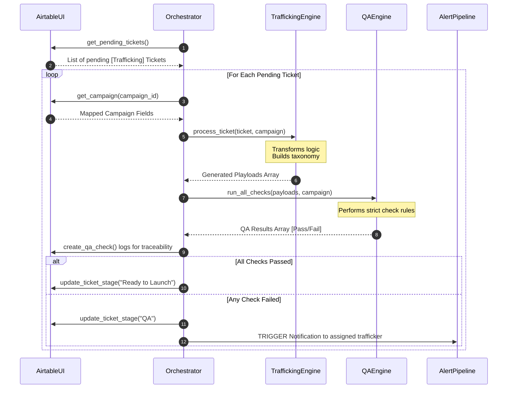

# Disney Ad Ops Lab: System Architecture & Sub-System Design

This document provides a deep dive into the architectural design of the automation tools built for the Disney Ad Ops Lab. It breaks down the overall system flow and then explores each Python module's sub-system design using visual diagrams.

---

## 🏗️ 1. Overall System Architecture

The Disney Ad Ops Lab is designed as a multi-tier architecture connecting a human-facing operational UI (BOAT/Airtable) with a heavy-duty data lakehouse (Databricks) via a centralized automation brain (EVE Orchestrator).


---

## 🧩 2. Sub-System Designs

### A. Data Generation Sub-System (`data_generator.py`)
This sub-system simulates historical Disney data. It ensures we have perfectly modeled reference taxonomies and massive volumes of delivery data (impressions, clicks) to test the analytical limits of Databricks.


### B. Airtable Client Intermediary (`src/airtable/client.py`)
This wrapper acts as the strictly typed interface between the raw HTTP responses of `pyairtable` and our internal Python domain logic.

```mermaid
classDiagram
    %% Styling
    class AirtableClient {
        -api: pyairtable.Api
        -base_id: String
        +get_pending_tickets() List
        +get_campaign(campaign_id) Dict
        +update_ticket_stage(record_id, new_stage)
        +create_qa_check(ticket_id, result, details)
        -_get_table(table_name)
    }
    
    class pyairtable {
        <<Library>>
        +Api(pat)
        +table(base, name)
    }

    class AirtableAPI {
        <<Cloud Service>>
        +GET /v0/{base}/{table}
        +PATCH /v0/{base}/{table}
        +POST /v0/{base}/{table}
    }

    AirtableClient --> pyairtable : Wraps Authentication (.env)
    pyairtable --> AirtableAPI : REST JSON Interop
```

### C. EVE Trafficking Engine (`src/trafficking/engine.py`)
This is the core business logic. It translates human instructions from Airtable into machine-readable actions and standardizes Disney naming conventions.


### D. Automated QA Engine (`src/trafficking/qa_engine.py`)
The safety net. Before any generated payload hits the internet, it must pass a suite of rigid compliance checks to prevent brand safety issues or massive budget losses.


### E. Alerting Pipeline (`src/alerting/pipeline.py`)
Handles asynchronous communication with human teams when the orchestrator encounters blocked workflows or SLA breaches.


### F. The Master Orchestrator (`src/orchestrator.py`)
The infinite loop that binds all sub-systems. It fetches work, processes it, QA's it, and writes the results back.


