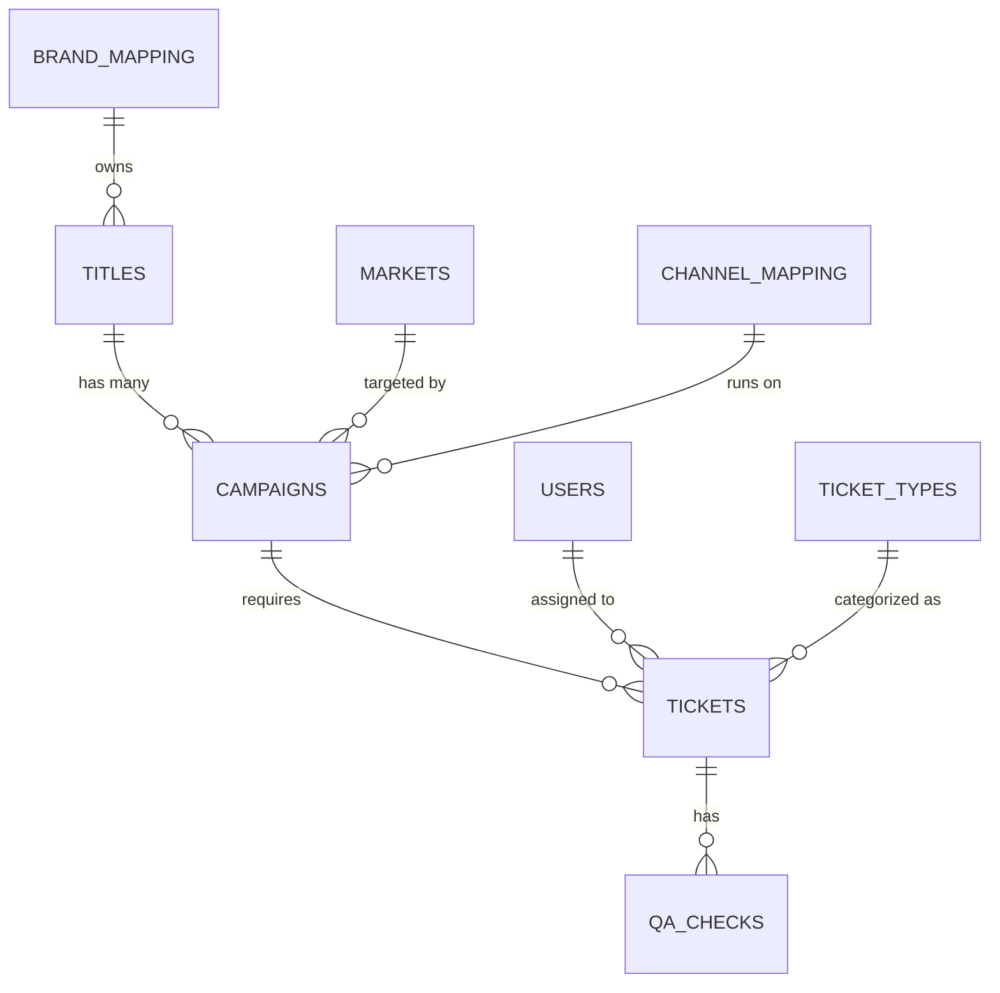

# Disney Ad Ops Lab: Airtable Schema Explained

When you built those "Links to other records," you effectively built a **Relational Database**. Instead of having to type out "Loki Season 3" or "Disney+ Standalone" a hundred times across different spreadsheets, you store it *once* and link it everywhere else.

Here is a visual map of exactly how your new Ad Ops system is connected:

*(How to read this diagram: The `||` means "One", and the `o{` means "Many". For example, One Title has Many Campaigns. One Ticket has Many QA Checks).*

---

### Phase 1: The Reference Tables (The "Lookup" Lists)
These are tables that rarely change. They exist purely to standardize data so nobody makes typos (e.g., spelling it "Disney +" instead of "Disney+").
*   **markets**, **brand_mapping**, **channel_mapping**, **audiences**: These act as standard dropdown lists for the entire company.
*   **users**: Every employee (like you) on the Growth Marketing or Engineering teams.
*   **ticket_types**: The predefined catalog of requests (e.g., "New Campaign", "Budget Shift").

### Phase 2: The Core Business (The Hierarchy)
This is where the actual Disney advertising hierarchy lives:
*   **titles (The Parent):** A piece of content (e.g., *Moana Live Action*). It links to `brand_mapping` to know it belongs to *Marvel* or *Disney+*.
*   **campaigns (The Child):** The actual marketing push. A single Title might have 50 different Campaigns running at the same time (e.g., one Campaign on Facebook in the US, another on YouTube in Canada). It links "up" to the `title`, and "sideways" to the `market` and `channel`.

### Phase 3: The Operational Workflow (The Human Tasks)
This is where the daily work actually happens in Airtable:
*   **tickets:** A specific request assigned to a human (e.g., "Set up these ad tags by Friday"). A Ticket links exactly to **One Campaign**, **One User** (the assignee), and **One Ticket Type**.
*   **qa_checks:** The safety net. Before a Ticket can be marked "Ready to Launch," the system generates several QA rows (e.g., "Check Geo-targeting", "Check Spec Compliance"). These all link back to that single Ticket.

### Why does this matter for automation?
Because of this exact structure, your Python Orchestrator (`src/orchestrator.py`) doesn't have to guess what "CM360" means. When it reads a Ticket, it can automatically follow the links backward: 
1. It sees the **Ticket** is for `CMP-0042`.
2. It looks at **Campaign** `CMP-0042` and sees it is for Title `TTL-0001` running in the `US` on `ProgDisplay`.
3. It looks at **Title** `TTL-0001` and sees it is for `Loki Season 3` on `Disney+`.
4. The Python script then uses that perfect chain of data to automatically construct the exact taxonomy: `PLUS_Loki_Acq_US_ProgDisplay` and push it to the ad server via API!
